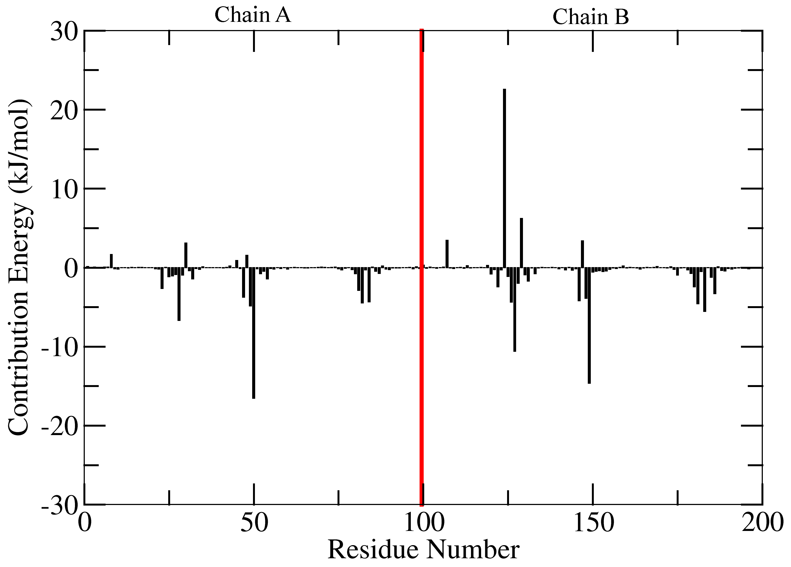
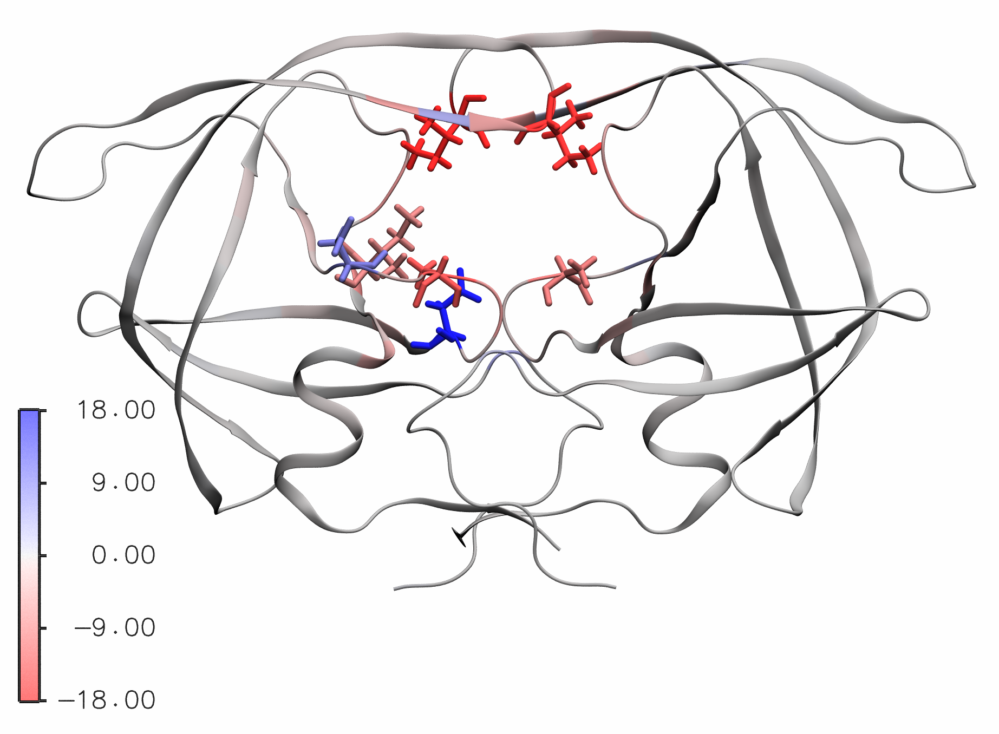

Contribution of residues to the binding energy 
==============================================

This tutorial is continuation of a `previous tutorial <binding-energy.html>`_.
The required input files for this tutorial were generated in previous one.
To calculate average contribution of the residues to the binding energy following command can be used:
::

    g_mmpbsa decompose -bs -nbs 2000 -m contrib_MM.dat -p contrib_pol.dat -a contrib_apol.dat
    
Three files ``final_contrib_energy.dat``, ``final_contrib_energy.csv`` and ``energyMapIn.dat`` 
are obtained after executing the above command. ``final_contrib_energy.dat`` and ``final_contrib_energy.csv``
contains average with standard error (without bootstrap: standard deviation) values of the 
energy of contribution to all three energetic terms including binding energy for each residues. 

The contribution energy of residues could be plotted using file ``energyMapIn.dat`` 
with xmgrace/matplotlib/gnuplot, although value of last residue (inhibitor) should be 
removed during plotting. For example, a xmgrace format file is provided in `tutorial/1EBZ/output`.

Visualization of contribution energy in VMD 
--------------------------------------------

To visualize the contribution energy of residue with its structure, 
a PDB file containing energy values in B-factor field is required. 
This file could be generated using either ``g_mmpbsa run`` with ``-opdb`` option or 
using ``g_mmpbsa energy2bfac`` command.

::

    g_mmpbsa energy2bfac -s 1EBZ_pbc_corrected.tpr -i energyMapIn.dat

Three files ``complex.pdb``, ``subunit_1.pdb`` and ``subunit_2.pdb`` are obtained with 
default names. ``subunit_1.pdb`` and ``subunit_2.pdb`` are the PDB structure file for 
first and second group number, respectively. Now, load the PDB file in the VMD as follows:

::

    vmd  subunit_1.pdb

Change graphical representation to ``NewCartoon`` in ``Drawing Method``.
Change ``Coloring Method`` to ``Beta``. To get a color scale bar, go to 
``Extension`` → ``Visulaization`` → ``Color Scale Bar``.
Choose ``Autoscale: On``. Chose ``Label format: Decimal``.
Then, click on ``Color Scale Bar``.

One could visualize the protein as shown in following figure in which residues with energy 
< -5.0 and energy > 5.0 are shown in licorice representation.

This visualization state could be loaded in VMD as file is provided in 
``tutorial/1EBZ/output/contribution_energy.vmd``.
Previously obtained ``subunit_1.pdb`` file should be present in the current directory. 
Open VMD, click on ``File`` → ``Load Visualization State …`` and open the provided 
``contribution_energy.vmd`` file.

