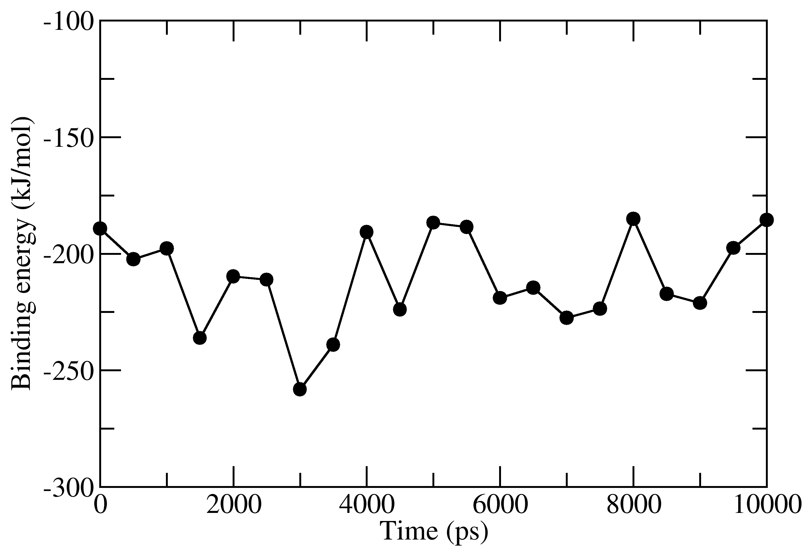
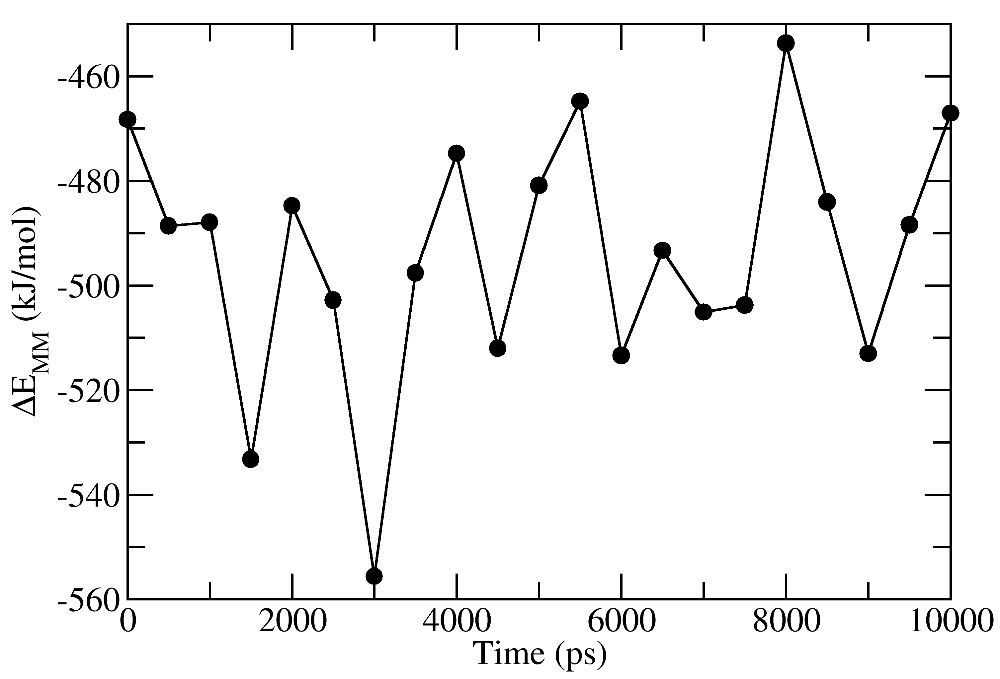
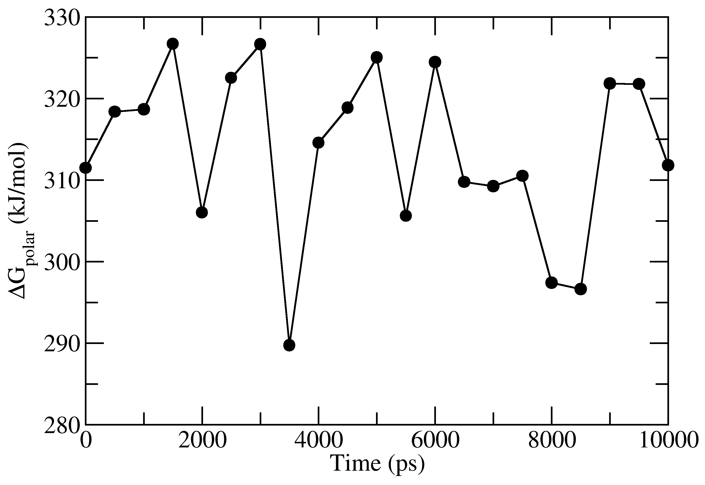
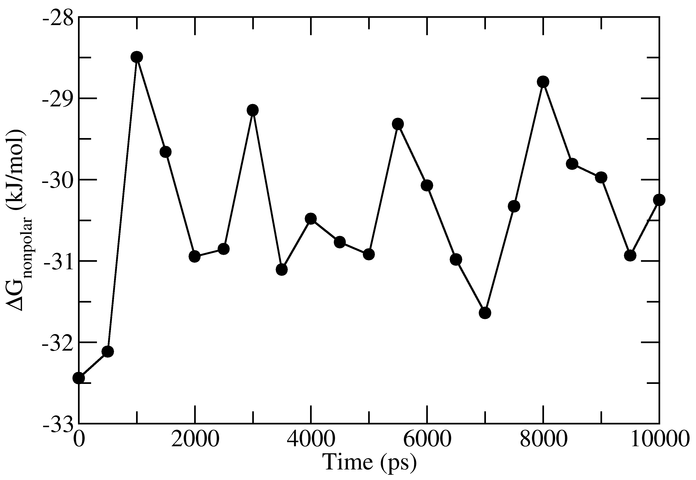

.. |g_mmpbsa publication| raw:: html

   <a href="http://pubs.acs.org/doi/abs/10.1021/ci500020m" target="_blank">g_mmpbsa publication</a>

Binding energy calculation
==========================

Download Tutorial Package 
--------------------------

To download the tutorial package, click on this `link <https://raw.githubusercontent.com/rjdkmr/g_mmpbsa/master/test/tutorial.tar.gz>`_.
This package contains required file for the tutorial.

Untar this package by following command: 

::

    tar -zxvf tutorial.tar.gz
    cd tutorial
    cd 1EBZ

This directory contains topology-parameter (``tpr``), 
atom-index (``ndx``), and trajectory (``xtc``) files of a HIV-1 protease inhibitor complex.

Calculation of three energy components 
--------------------------------------

The binding energy consists of three energetic terms,

(a) potential energy in vacuum,
(b) polar-solvation energy and
(c) non-polar solvation energy. 

These energetic terms could be calculated in either three or one step.

Three steps calculation 
------------------------

1. Calculation of potential energy in Vacuum 
~~~~~~~~~~~~~~~~~~~~~~~~~~~~~~~~~~~~~~~~~~~~~

Execute the following command:

::

    g_mmpbsa run -f 1EBZ.xtc -s 1EBZ.tpr -n 1EBZ.ndx -pdie 2 -decomp -unit1 Protein -unit2 BEC

Here we are selecting ``Protein`` as unit-1 and ``BEC``, which is a ligand, as unit-2. The binding
energy will be calculated between the protein and ligand.

Two files ``energy_MM.xvg`` and ``contrib_MM.dat`` are generated as outputs.
Both files could be generated with different name by 
``-mm filename1.xvg`` and ``-mmcon filename2.dat``.

``energy_MM.xvg`` file contains van der Waals, electrostatic interactions, and net non-bonded potential 
energy between the protein and inhibitor. 
``contrib_MM.dat`` contains contribution of each residue to the calculated net 
non-bonded interaction energy.

2. Calculation of polar solvation energy 
~~~~~~~~~~~~~~~~~~~~~~~~~~~~~~~~~~~~~~~~~

To calculate the polar solvation energy, an input file (e.g. tutorial/polar.mdp) is required.
This file contains input parameters that are used in the calculation of polar solvation energy.

.. note:: `Please click here for details about polar solvation input parameters <../parameters/polar-parameters.html>`_.

Execute the following command:

::

    g_mmpbsa run -f 1EBZ.xtc -s 1EBZ.tpr -n 1EBZ.ndx -i ../polar.mdp -nomme -pbsa \
                 -decomp -unit1 Protein -unit2 BEC -pol polar.xvg -pcon contrib_pol.dat

Two files ``polar.xvg`` and ``contrib_pol.dat`` are generated as outputs.
Both files could be generated with different name by ``-pol filename1.xvg``
and ``-pcon filename2.dat``. 

``polar.xvg`` contains polar solvation energies for unbound protein, unbound inhibitor 
and protein-inhibitor complex.
``contrib_pol.dat`` contains contribution of each residue to the calculated net polar 
solvation energy.

3. Calculation of non-polar solvation energy
~~~~~~~~~~~~~~~~~~~~~~~~~~~~~~~~~~~~~~~~~~~~~

To calculate the non-polar solvation energy, an input file (e.g. tutorial/apolar_sasa.mdp) 
is required. This file contains parameters that are used in the calculation of non-polar 
solvation energy. 

There are several type of non-polar models that are discussed in the |g_mmpbsa publication|.
Here, SASA-only and SAV-only model are used for which input parameter files are provided.

.. note:: `Please click here for details about non-polar solvation input parameters <../parameters/non-polar-parameters.html>`_.

.. warning:: Now WCA model is removed from the g_mmpbsa package.

**For SASA-only model:**

Execute the following command:
::
    
    g_mmpbsa run -f 1EBZ.xtc -s 1EBZ.tpr -n 1EBZ.ndx -i ../apolar_sasa.mdp -nomme -pbsa -decomp \
                 -unit1 Protein -unit2 BEC -apol sasa.xvg -apcon sasa_contrib.dat

Two files ``sasa.xvg`` and ``sasa_contrib.dat`` are generated as outputs.
``sasa.xvg`` contains non-polar solvation energy for unbound protein, 
unbound inhibitor and protein-inhibtor complex. ``sasa_contrib.dat`` 
contains contribution of each residue to the calculated net polar-solvation energy.

**For SAV-only model:**

Execute the following command:

::
    
    g_mmpbsa run -f 1EBZ.xtc -s 1EBZ.tpr -n 1EBZ.ndx -i ../apolar_sav.mdp -nomme -pbsa -decomp \
                 -unit1 Protein -unit2 BEC -apol sav.xvg -apcon sav_contrib.dat`

Two files ``sav.xvg`` and ``sav_contrib.dat`` are generated as outputs.
``sav.xvg`` contains non-polar solvation energy for unbound protein, 
unbound inhibitor and protein-inhibtor complex. ``sav_contrib.dat`` 
contains contribution of each residue to the calculated net polar-solvation energy.

One step calculation
--------------------

Execute the following command:

::
    
    g_mmpbsa run -f 1EBZ.xtc -s 1EBZ.tpr -n 1EBZ.ndx -i ../pbsa.mdp -pdie 2 -pbsa -decomp \
                 -unit1 Protein -unit2 BEC -os energy_summary.csv \
                 -ores residues_energy_summary.csv -silent

Here we are selecting ``Protein`` as unit-1 and ``BEC``, which is a ligand, as unit-2. The binding
energy will be calculated between the protein and ligand.

``pbsa.mdp`` contains input parameters for both polar and SASA-only non-polar solvation energies.
All three energetic terms are calculated by using the above single command and all output files 
are generated.

``-os energy_summary.csv``
~~~~~~~~~~~~~~~~~~~~~~~~~~~

It will also calculate average binding energy and standard deviation of all the energy terms
and will be output in **CSV format** ``energy_summary.csv`` file provided with ``-os`` option.
This file can be dirctely opened in MS excel or any other spreadsheet software. 

::

  "Energy"             , "Average", "Standard-Deviation", 
  "vDW"                , -334.587 ,               15.897, 
  "Electrostatic"      , -318.759 ,               32.401, 
  "Polar-solvation"    , 313.703  ,               10.426, 
  "Non-polar-solvation", -30.420  ,                1.016, 
  "Total"              , -370.062 ,               32.903,

``-ores residues_energy_summary.csv``
~~~~~~~~~~~~~~~~~~~~~~~~~~~~~~~~~~~~~~
This file contain summary of binding energy contributions (both average and standard deviation) 
of residues over all frames.

The output file has following rows and columns:

::

    "Resdiue", "vDW"   , "vdW-stddev", "Elec." , "Elec.-stdev", "polar", "polar-stdev", "apolar", "apolar-stdev", "total" , "total-stdev", 
    "PRO-1"  , -0.004  ,        0.001, 0.655   ,         0.660, -0.202 ,         0.186, 0.000   ,          0.000, 0.449   ,         0.520, 
    "GLN-2"  , -0.005  ,        0.000, 0.094   ,         0.074, -0.112 ,         0.060, 0.000   ,          0.000, -0.023  ,         0.032, 
    "ILE-3"  , -0.018  ,        0.003, -0.083  ,         0.035, 0.101  ,         0.025, 0.000   ,          0.000, -0.000  ,         0.029, 
    "THR-4"  , -0.014  ,        0.001, -0.013  ,         0.073, 0.004  ,         0.044, 0.000   ,          0.000, -0.022  ,         0.062, 
    "LEU-5"  , -0.078  ,        0.009, 0.169   ,         0.061, -0.015 ,         0.056, 0.000   ,          0.000, 0.076   ,         0.055, 
    "TRP-6"  , -0.039  ,        0.005, 0.164   ,         0.056, 0.009  ,         0.025, 0.000   ,          0.000, 0.134   ,         0.052, 
    "GLN-7"  , -0.068  ,        0.014, -0.211  ,         0.152, 0.238  ,         0.086, 0.000   ,          0.000, -0.040  ,         0.132, 
    "ARG-8"  , -5.167  ,        1.695, -3.454  ,         4.016, 9.184  ,         4.154, -0.637  ,          0.191, -0.074  ,         3.831, 
    "PRO-9"  , -0.202  ,        0.041, -0.029  ,         0.120, 0.076  ,         0.072, 0.000   ,          0.000, -0.155  ,         0.122, 
    "LEU-10" , -0.196  ,        0.057, -0.046  ,         0.061, 0.034  ,         0.027, 0.000   ,          0.000, -0.208  ,         0.077, 
    .
    .
    .

Average Binding Energy Calculation
----------------------------------

The average binding energies can be directly calculated in one-step method as described above.
However, the bootstrap analysis could be used to calculate the average binding energy with standard error.

To calculate average binding energy, execute following command:

::

    g_mmpbsa average -m energy_MM.xvg -p polar.xvg -a apolar.xvg -bs

Three output files ``full_energy.dat``, ``summary_energy.dat`` and 
``summary_energy.csv`` are obtained. Both ``summary_energy.dat`` and ``summary_energy.csv`` 
contains average and standard deviations of all energetic components 
including the binding energy as follows:

::

    #Complex Number:    1 
    =============== 
       SUMMARY   
    =============== 

     van der Waal energy      =        -334.587   +/-   15.514 kJ/mol 

     Electrostattic energy    =        -159.380   +/-   15.810 kJ/mol 

     Polar solvation energy   =         313.698   +/-   10.174 kJ/mol 

     SASA energy              =         -30.431   +/-    0.996 kJ/mol 

     SAV energy               =           0.000   +/-    0.000 kJ/mol 

     WCA energy               =           0.000   +/-    0.000 kJ/mol 

     Binding energy           =        -210.699   +/-   19.745 kJ/mol 

    =============== 
        END     
    =============== 

``full_energy.dat`` contains the values of energetic terms as a function of time.
Last four columns contains  Δ_E_MM, Δ_G_polar, Δ_G_nonpolar and Δ_G_binding 
as a function of time. These quantities could be plotted with xmgrace/matplotlib/gnuplot. 
The respective four files in xmgrace format (_agr_) are provided in `tutorial/1EBZ/output`

To calculate average binding energy by using bootstrap analysis, execute following command:

::

    g_mmpbsa run -bs -nbs 2000 -m energy_MM.xvg -p polar.xvg -a apolar.xvg

Again, two output files ``full_energy.dat`` and ``summary_energy.dat`` are genrated as outputs.
``full_energy.dat`` is similar to that of the above one.
However, ``summary_energy.dat`` contains average and standard error of all energetic components 
including the binding energy.  
Average values in ``summary_energy.dat`` are slightly different from the above one.
For more details about this method, please follow the |g_mmpbsa publication|.